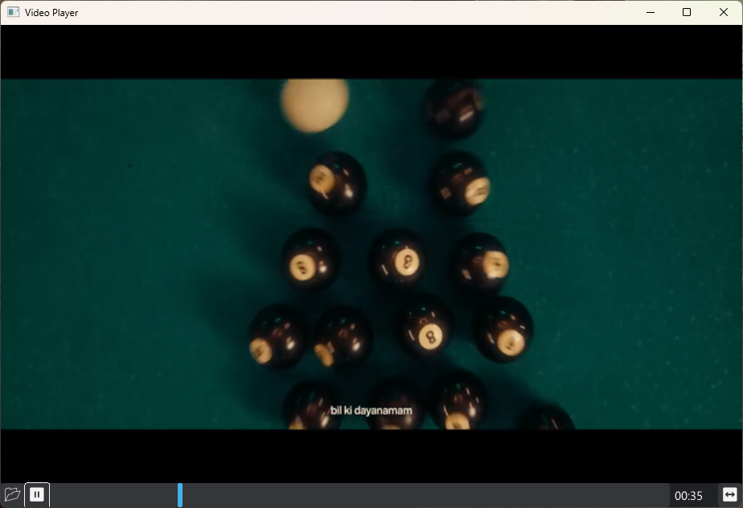

# MUIMPV - A Video Player Plugin for [MUI](https://github.com/malisipi/mui)

Do you need a video player library for your V/MUI application? *You are correct place!*

## For Windows

* Get MPV Shared library from [libmpv@sourceforge.net](https://sourceforge.net/projects/mpv-player-windows/files/libmpv/)
* Copy `include` folder and `libmpv-2.dll` into project folder
* Copy `libmpv-2.dll` into parent directory of executables
* And you're ready to go!

# For Linux

> *I will add instructions asap.*

## LICENSE

* The library was licensed with GPLv3.
* Also this project shares codebase with [mpv-v](https://github.com/xjunko/mpv-v) project.